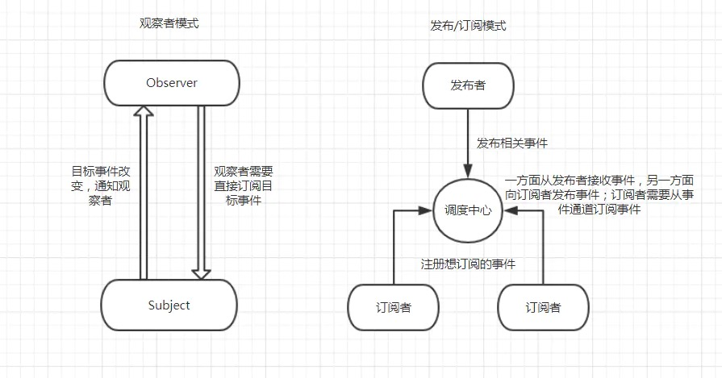

##### 定义

观察者模式又叫发布订阅模式（Publish/Subscribe），它定义了一种一对多的关系，让多个观察者对象同时监听某一个主题对象，这个主题对象的状态发生变化时就会通知所有的观察者对象，使得它们能够自动更新自己。



node中的EventEmitter实际上就是一个观察者模式

```js
class EventEmitter {
  constructor() {
    this.eventManager = {}
  }

  on(eventName, callback) {
    if(!this.eventManager[eventName]) {
      this.eventManager[eventName] = []
    }

    this.eventManager[eventName].push(callback)
  }

  emit(eventName, data) {
    if(this.eventManager && this.eventManager[eventName]) {
      this.eventManager[eventName].map(function(callback) {
        callback.call(this, data);
      })
    }
  }
}

```

##### 适用场景
- Dom事件监听
- 多个类解耦需要通信

##### 优点
- 支持简单的广播通信，自动通知所有已经订阅过的对象
- 解耦，类之间的通信

##### 缺点
- 创建订阅者本身要消耗一定的时间和内存，订阅的处理函数不一定会被执行，驻留内存有性能开销
- 过度使用会导致对象与对象之间的联系弱化，会导致程序难以跟踪维护和理解
##### 场景例子

Dom 事件监听

```js
document.body.addEventListener('click', function() {
    console.log('hello world!');
});
document.body.click()

```

多个类的解耦，并通信
```js
// portal.js
import Emitter from 'common/event-emitter';
import Main from './main';
import SideLeft from './side-left';
import SideRight from './side-right';

export default class EventChannel {
  constructor() {
    this.emitter = new Emitter();
    this.registerSubject();
  }

  registerSubject() {
    this.main = new Main(this.emitter);
    this.sideLeft = new SideLeft(this.emitter);
    this.sideRight = new SideRight(this.emitter);
  }
}

```

```js
// side-left.js 示例
export default class SideLeft {
  constructor(channel) {
    super();

    this.channel = channel;
    this.$sideLeft = $('.js-aside-left');

    this.init();
  }

  init() {
    this.initEvent();
  }

  initEvent() {
    this.$sideLeft.on('click', '.js-aside-item', (event) => { this.handleSideLeftClick(event); });
  }

  handleSideLeftClick(event) {
    this.channel.emit('sideClick', { content: '', editor: '' });
  }
}
```